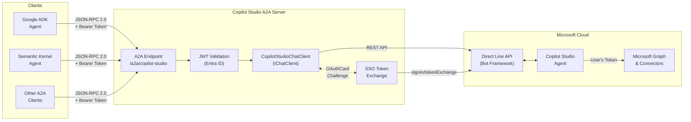
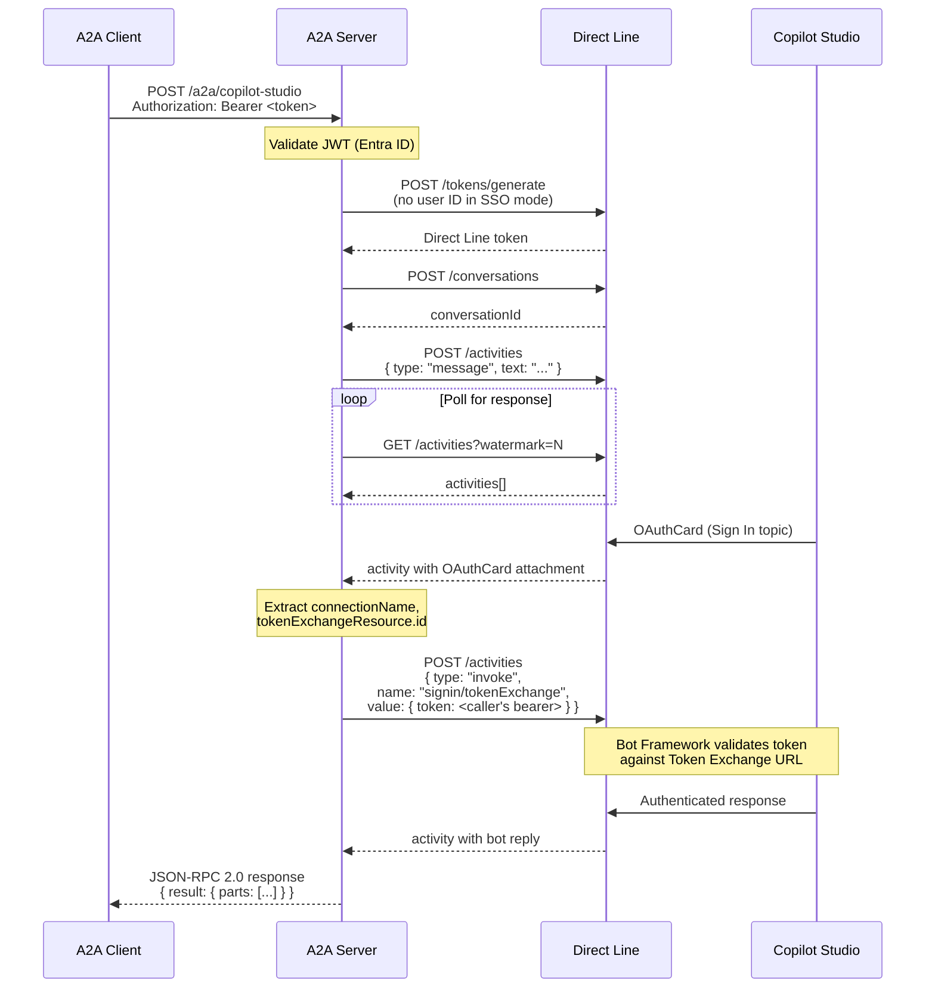
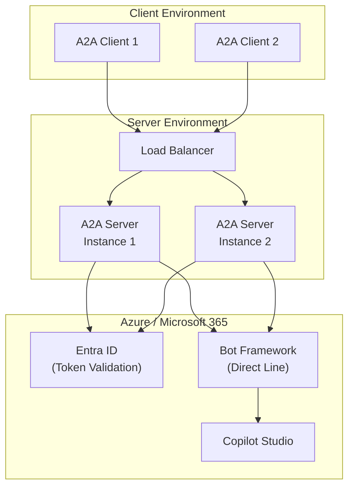

# Architecture

## High-Level Overview

## Request Flow

## Component Details

### A2A Endpoint Layer

The `MapA2A()` extension from `Microsoft.Agents.AI.Hosting.A2A.AspNetCore` handles JSON-RPC 2.0 protocol details natively — parsing requests, routing to the `IChatClient`, and formatting responses. The server adds:

- **JWT middleware** — validates Entra ID bearer tokens on POST requests when `EnableAuthPassthrough` is enabled
- **Agent card** — served at `GET /a2a/copilot-studio/v1/card` for A2A agent discovery

### CopilotStudioChatClient

The core bridge component implementing `IChatClient`. Responsibilities:

| Method | Purpose |
|--------|---------|
| `GetResponseAsync` | Orchestrates the full flow: token → conversation → message → poll → response |
| `GetTokenAsync` | Exchanges Direct Line secret for a scoped token |
| `StartConversationAsync` | Opens a new Direct Line conversation |
| `SendMessageAsync` | Posts a user message as a Direct Line activity |
| `PollForResponseAsync` | Polls for bot replies, handles OAuthCard interception |
| `SendTokenExchangeAsync` | Sends `signin/tokenExchange` invoke for SSO |
| `ExtractOAuthCardInfo` | Parses OAuthCard attachments from bot activities |
| `ResolveDirectLineUserId` | Derives a stable user ID from JWT claims |

### SSO Token Exchange

When SSO is enabled (Phase 2), the server acts as the "canvas" in Microsoft's SSO pattern:

1. **No trusted user ID** — Direct Line tokens are generated without a `dl_`-prefixed user ID, allowing the bot's Sign In system topic to trigger
2. **OAuthCard interception** — when the bot sends an OAuthCard with `tokenExchangeResource`, the server intercepts it instead of displaying a sign-in prompt
3. **Token passthrough** — the caller's original bearer token (audience: `api://<clientId>`) is sent directly via `signin/tokenExchange` — no OBO (On-Behalf-Of) exchange needed since the audience already matches the Token Exchange URL
4. **Retry detection** — if Direct Line returns `"retry"` in the response, the exchange failed and the bot may fall back to a sign-in prompt

## Deployment Architecture

The server is stateless — each request creates a new Direct Line conversation. This makes horizontal scaling straightforward: deploy multiple instances behind a load balancer with no shared state required.

### Configuration

Secrets are managed via:
- **Local development**: `dotnet user-secrets`
- **Production**: Environment variables or a secrets vault (e.g., Azure Key Vault)

See [authentication.md](authentication.md) for the complete setup guide.
